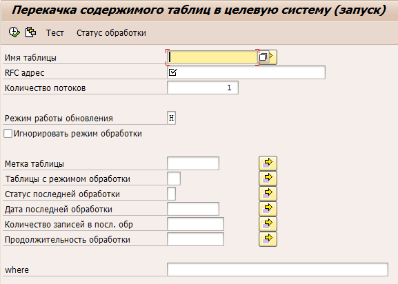

## Копирование манданта по RFC
Пришлась разработать свой велосипед для копирования мандата между системами, хочу поделиться разработкой

Есть конечно штатное копирование, но оно нам по ряду причин не подходило, поэтому разработал своё. Ниже опишу вкратце характеристики:
* Выполняется по RFC.
* Запускается из системы источника данных.
* Копируются только манданто-зависимые таблицы.
* Если структура таблиц между системами отличается – копируются поля имеющиеся в обоих системах.

Понадобится RFC соединение с сохранённым паролем, или доверительное соединение с системой принимающей данные.

Запускается программой YDK_RFC_TABDATA_TRANSFER_RN

«Имя таблицы» если не указать – будут выбраны для обработки все манданто-зависимые таблицы
«Количество потоков» — указываем количество потоков. В системе отправителе будет запущенно в фоне указанное количество программ YDK_RFC_TABDATA_TRANSFER_TH, в целевой системе работу потоков можно отслеживать через SM51
«Зачистить таблицу перед загрузкой» — по умолчанию установлена, если установлено в целевой системе данные из таблицы сначала удаляются (для некоторых таблиц требуется значительное время), а затем выполняется загрузка данных из системы источника. Если эту галку не устанавливать — в целевой системе могут остаться записи с старыми данными
«Игнорировать режим обработки» — в YDK_TRANSFER_TAB- CMODE может быть указан режим обработки таблицы: «Не копировать», «Не отчищать таблицу», «Копировать если изменилось количество записей». Эта галка позволяет игнорировать эту настройку.
«Метка таблицы» — проверяет значение в поле YDK_TRANSFER_TAB-LABL, можно использовать для отбора определённых таблиц
«Таблицы с режимом обработки» — проверяет значение поля YDK_TRANSFER_TAB- CMODE
«Статус последней обработки» — например позволяет отобрать таблицы при обработке которых возникли ошибки, и таким образом обработать их ещё раз.
«Количество записей в посл. обр», «Продолжительность обработки» — отбор по статистике собранной по таблице в предыдущей передаче данных.

