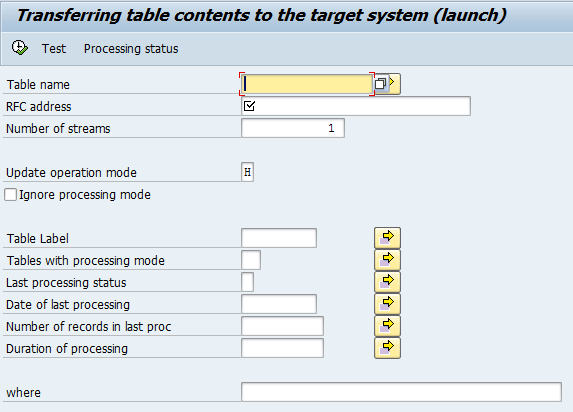

## Copy SAP mandant via RFC

There is, of course, a standard mandant copy, but it was not suitable for us for a number of reasons, so I developed my own. I'll give you a brief description of the features below:
* Runs by RFC.
* Runs from the data source system.
* Only mandant-specific tables are copied.
* **If the structure of tables is different between the systems**, the fields available in both systems are copied.
* The program is suitable for copying individual mandant-specific tables between systems

RFC connection with saved password or trust connection to the receiving system is required.

Starts with the program YDK_RFC_TABDATA_TRANSFER_RN.

* **"Table name"** if not specified - all mandant-dependent tables will be selected for processing
* **"RFC address"** RFC address of the recipient system, configurable in SM59 connection must be saved with password or trust connection 
* **"Number of streams"** - specify the number of streams. In the sender system, the specified number of programs YDK_RFC_TABDATA_TRANSFER_TH will be launched in the background, and in the target system the work of streams can be monitored via SM51.
* **"Update operation mode"** - determines how the data in the target system tables will be updated
* **"Ignore processing mode"** - the table processing mode can be specified in YDK_TRANSFER_TAB-CMODE: "Do not copy", "Do not clear the table", "Copy if the number of records has changed". This checkbox allows you to ignore this setting.
* **"Table Label"** -checks the value in YDK_TRANSFER_TAB-LABL field, you can use it to select certain tables
* **"Tables with processing mode"** - checks the value of field YDK_TRANSFER_TAB-CMODE, can be used to select certain tables
* **"Last processing status"** - for example, allows you to select tables during the processing of which errors occurred, and thus to process them again.
* **"Number of records in last proc"**, **"Duration of processing"** - selection by statistics collected by the table in the previous data transmission.
* **"where"** - SQL where, which will be applied when selecting data from tables in the source system. For the data transmission to be successful, "where" must be correct in relation to the table

Update operation mode:
* "I" Inserting data (the table is cleaned before inserting)
* "H" update+addition of records with deletion of unnecessary ones
* "M" update+addition of records without deleting unnecessary (Modify)
* "S" adding records without deleting unnecessary ones (Insert acepting duplicate)

"Processing status" button - displays the ALV report with table processing statistics for the running streams

**Copying the mandat**
The following practice has proven to be a good practice for mandant copying:
First, the mandant in the receiving system is deleted by standard SAP tools (this perceptibly reduces the copying time as it is not spent on deleting data in tables).
Then copying in "S" mode is started, "SAP*" user with his password is registered in RFC connection setting, "USR02" table should be excluded from the list of transmitted tables.
When you have finished copying, you must copy the tables separately: 
* "NRIV" - number range data
* "USR02" - user data, after copying it, access to the RFC mandant under "SAP*" user will not be possible.

In the receiving system, start the SM56 transaction than press F5 button, set checkbox "Global reset" and execute - this will reset the number ranges stored in memory.

**Algorithm:**
Program YDK_RFC_TABDATA_TRANSFER_RN, generates a list of tables and stores it in the YDK_TRANSFER table with setting field values:
* YDK_TRANSFER-STATUS = "I" - mast be processed
* YDK_TRANSFER-LDATE and YDK_TRANSFER-LTIME = the current date and time, the same for all rows, is used as a copy job identifier

Then the program YDK_RFC_TABDATA_TRANSFER_RN plans background jobs according to the parameter "Number of streams", in the background job the program YDK_RFC_TABDATA_TRANSFER_TH is executed.

Running in the background YDK_RFC_TABDATA_TRANSFER_TH in a competitive mode selects unprocessed records from the table YDK_TRANSFER and runs the program YDK_RFC_TABDATA_TRANSFER to transfer table data to the target system.

The program YDK_RFC_TABDATA_TRANSFER calls FM YDK_RFC_TRANSFER_INIT via RFC to initialize the transfer and then transmits table data via RFC calls of FM YDK_RFC_TRANSFER_RECIVE.
