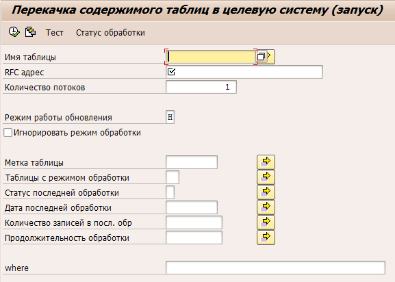

## Копирование манданта SAP по RFC
Пришлось разработать свой велосипед для копирования мандата между системами, хочу поделиться разработкой

Есть конечно штатное копирование, но оно нам по ряду причин не подходило, поэтому разработал своё. Ниже опишу вкратце характеристики:
* Выполняется по RFC.
* Запускается из системы источника данных.
* Копируются только манданто-зависимые таблицы.
* **Если структура таблиц между системами отличается** – копируются поля имеющиеся в обоих системах.
* Программа пригодна для копирования отдельных манданто-зависимых таблиц между системами

Понадобится RFC соединение с сохранённым паролем, или доверительное соединение с системой принимающей данные.

Запускается программой YDK_RFC_TABDATA_TRANSFER_RN

* **«Имя таблицы»** если не указать – будут выбраны для обработки все манданто-зависимые таблицы
* **«RFC адрес»** RFC адрес системы получателя, настраивается в SM59 соединение должно быть сохранено с паролем или доверительное соединение 
* **«Количество потоков»** — указываем количество потоков. В системе отправителе будет запущенно в фоне указанное количество программ YDK_RFC_TABDATA_TRANSFER_TH, в целевой системе работу потоков можно отслеживать через SM51
* **«Режим работы обновления»** — определяет как будут обновляться данные в таблицах целевой системы
* **«Игнорировать режим обработки»** — в YDK_TRANSFER_TAB-CMODE может быть указан режим обработки таблицы: «Не копировать», «Не отчищать таблицу», «Копировать если изменилось количество записей». Эта галка позволяет игнорировать эту настройку.
* **«Метка таблицы»** — проверяет значение в поле YDK_TRANSFER_TAB-LABL, можно использовать для отбора определённых таблиц
* **«Таблицы с режимом обработки»** — проверяет значение поля YDK_TRANSFER_TAB-CMODE, можно использовать для отбора определённых таблиц
* **«Статус последней обработки»** — например позволяет отобрать таблицы при обработке которых возникли ошибки, и таким образом обработать их ещё раз.
* **«Количество записей в посл. обр»**, **«Продолжительность обработки»** — отбор по статистике собранной по таблице в предыдущей передаче данных.
* **«where»** — SQL where, которое будет применено при отборе данных из таблиц в исходной системе, для того чтобы передача данных прошла успешно where должно быть корректным по отношению к таблице

Режимы обновления таблиц:
* «I» Вставка данных (перед вставкой выполняется отчистка таблицы)
* «H» обновление+добавление записей с последующим удалением лишних
* «M» обновление+добавление записей без удаления лишних (Modify)
* «S» добавление записей без удаления лишних (Insert acepting duplicate)

Кнопка "Статус обработки" - выводит ALV отчёт с статистикой обработки таблиц по запущенным процессам

**Копирование манданта**
При копировании мандантов хорошо зарекомендовала следующая практика:
Сначала мандант в принимающей системе удаляется стандартными средствами SAP (это существенно сокращает время копирования, поскольку оно не тратится на удаление данных из таблиц)
Затем запускается копирование в режиме «S», в настройку RFC соединения прописывается пользователь «SAP*» с его паролем, из списка передаваемых таблиц нужно исключить таблицу "USR02"
По завершении копирования нужно отдельно скопировать таблицы: 
* "NRIV" - данные диапазонов номеров
* "USR02" - данные пользователей, после её копирования доступ в мандант по RFC под пользователем «SAP*» станет не возможен

В принимающей системе запустить транзакцию SM56 нажать F5 поставить галку "ГлобальнСброс" и выполнить - это сбросит состояние диапазонов номеров сохранённое в памяти.


**Алгоритм работы:**
Программа YDK_RFC_TABDATA_TRANSFER_RN, формирует список таблиц и сохраняет его в таблице YDK_TRANSFER устанавливая значения полей:
* YDK_TRANSFER-STATUS = "I" - предстоит обработка
* YDK_TRANSFER-LDATE и YDK_TRANSFER-LTIME = текущие дата и время, одинаковые для всех таблиц, используется как идентификатор задания на копирование

Затем программа YDK_RFC_TABDATA_TRANSFER_RN планирует фоновые задания в соответствии с параметром «Количество потоков», в фоновом задании выполняется программа YDK_RFC_TABDATA_TRANSFER_TH

Запущенные в фоне программы YDK_RFC_TABDATA_TRANSFER_TH выбирают в конкурентном режиме не обработанные записи из таблицы YDK_TRANSFER и запускают программу YDK_RFC_TABDATA_TRANSFER для передачи данных таблицы в целевую систему

Программа YDK_RFC_TABDATA_TRANSFER вызывает по RFC ФМ YDK_RFC_TRANSFER_INIT для инициализации передачи а затем передаёт данные таблицы посредством вызовов по RFC ФМ YDK_RFC_TRANSFER_RECIVE

**Интересные моменты:**
Некоторые таблицы имеют очень большие размеры что существенно усложняет поставленную задачу:

Не возможно передать весь объём данных таблицы за один RFC вызов, поэтому надо данные передавать пакетами, что собственно не сложно организовать но RFC вызов вызывает неявный DB commit который рвёт выборку данных. Было протестировано множество вариантов, в конце концов в документации было найдено дополнение для call function KEEPING LOGICAL UNIT OF WORK «This addition is for internal use only. When this addition is used incorrectly, the worst case scenario may be a system shutdown, использование этого дополнения решило эту проблему, никаких проблем описанных в предупреждении не разу не возникало.
```ABAP
  OPEN CURSOR WITH HOLD cur FOR
    SELECT *
      FROM (tabname).
  DO.
    FETCH NEXT CURSOR cur INTO TABLE <tab> PACKAGE SIZE psize.
    IF sy-subrc <> 0. EXIT. ENDIF.
    CHECK NOT <tab> IS INITIAL.

    EXPORT tab FROM <tab> TO DATA BUFFER xstr.

    CALL FUNCTION 'YDK_RFC_TRANSFER_RECIVE'
      DESTINATION rfcdest
      KEEPING LOGICAL UNIT OF WORK " This addition is for internal use only. When this addition is used incorrectly, the worst case scenario may be a system shutdown.
      EXPORTING
        cluster               = xstr
      EXCEPTIONS
        system_failure        = 1
        communication_failure = 2
        OTHERS                = 5.
    IF sy-subrc <> 0.
      msg = |Ошибка при передаче данных { sy-subrc }|.
      EXIT.
    ENDIF.

    rowcount = rowcount + lines( <tab> ).
  ENDDO.
  CLOSE CURSOR cur.
```
Перед сохранением данных в целевом манданте, в целевой таблице надо удалить старые данные. Однако если таблица большая нельзя просто вызвать delete from <tabname> поскольку не хватит объёма roll back сегмента для отката транзакции и в результате дамп, поэтому удалять данные надо порциями с commit work между ними. Но к сожалению в синтаксисе delete from <tabname> нельзя указать сколько записей надо удалить, однако можно удалить используя таблицу с ключами полей DELETE (tabname) FROM TABLE <keytab>. Таким образом алгоритм такой: в цикле выбираем пачку ключевых полей в таблицу <keytab> затем удаляем их и так до тех пор пока в таблице не останется записей
```ABAP
  OPEN CURSOR WITH HOLD cur FOR
    SELECT (itfld)
      FROM (tabname).
  DO.
    FETCH NEXT CURSOR cur INTO TABLE <keytab> PACKAGE SIZE 1000.
    IF sy-subrc <> 0. EXIT. ENDIF.
    DELETE (tabname) FROM TABLE <keytab>.
    CALL FUNCTION 'DB_COMMIT'.
  ENDDO.
  CLOSE CURSOR cur.
```
Дополнение OPEN CURSOR WITH HOLD позволяет делать CALL FUNCTION ‘DB_COMMIT’ не прерывая выборку, если его не использовать при вызове DB_COMMIT курсор SQL запроса автоматически закроется. Однако это дополнение не срабатывает при RFC вызове… курсор всё равно закрывается.

Ещё одно замечание: как было выше написано «Если структура таблиц между системами отличается – копируются поля имеющиеся в обоих системах», для того чтоб это реализовать надо при загрузке данных сравнить структуру таблицы источника с таблицей приёмником, и если она отличается для переноса полей использовать move corresponding. Сначала для этих целей я хотел использовать классы cl_abap_datadescr=>describe_by_data и cl_abap_structdescr=>create( fct ) однако при тестировании системы оказалось, что работает это не удовлетворительно, поэтому я перешёл на классы cl_salv_bs_ddic=>get_components_by_data( <stab> ) и cl_salv_bs_ddic=>create_data_from_components. Насколько я помню (давно это было) проблема была связана с точностью описания и воспроизведения сложных структур – вложенные структуры/инклюды и т.п. правда и cl_salv_bs_ddic не безгрешен он спотыкается на полях в имени которых присутствует символ «-» но таких таблиц крайне мало.

**Ну и напоследок:**
Скопировать данные таблиц не достаточно, что в общем то было ожидаемо, требуется сделать ещё кое какие операции:

После копирования таблицы диапазонов номеров NRIV (и не только) необходимо сделать сброс буфера диапазона номеров , иначе номера будут выдаваться из сделанного буфера, что может привести duplicate record insert. При копировании этой таблицы, сброс выполняется автоматически, но может потребоваться сделать это в ручную, делается это транзакцией SM56 затем кнопка F5.

В некоторых таблицах хранится логческое имя системы (домен LOGSYS) , что приводит к тому что в целевой системе скопированные документы считаются прибывшими из чужой системы… поэтому сделана автоматическая замена в соотв. полях имени системы источника на имя системы приёмника